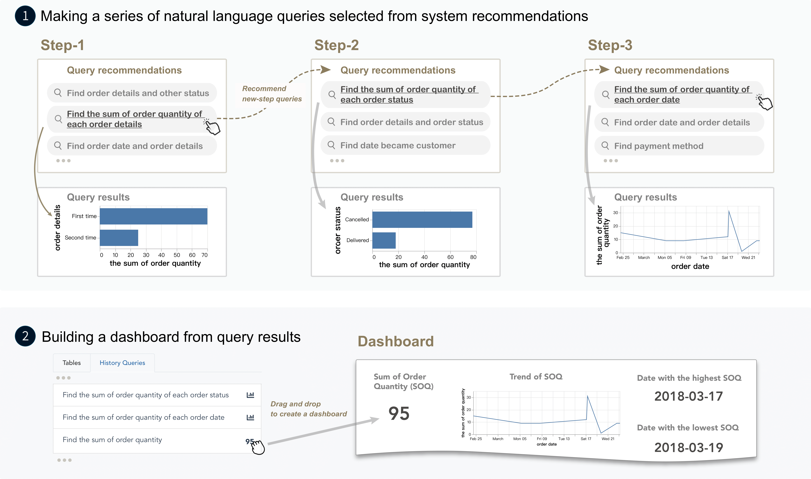
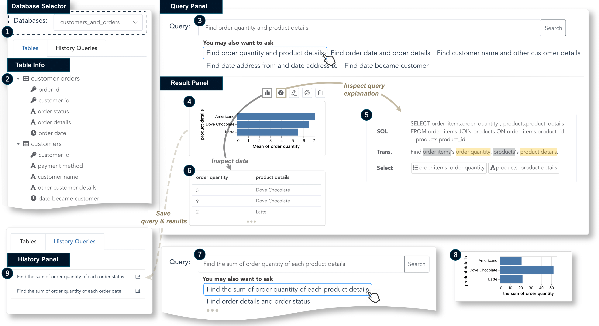

# QRec-NLI: Interactive Data Analysis with Next-step Natural Language Query Recommendation
[**QRec-NLI**](https://arxiv.org/abs/2201.04868) is a natural language interface (NLI) with a step-wise query recommendation module to guide visual data analysis, where data is stored across multiple tables in SQL databases. Please checkout [our paper](https://arxiv.org/abs/2201.04868) for more details.


>*User workflow*: (1) A user first makes a series of natural language data queries by selecting from system recommendations step by step. The results of data queries are presented in visualizations. (2) After several steps of data exploration, the user chooses some desired insights (shown in visualizations) from previous queries, and organizes them into a dashboard by direct manipulation.

The system adopts a log-based approach to generate ***semantically-relevant*** and ***context-aware*** query suggestions that adapt to a user's interested domains based on all queries made by current user and  reference queries in query databases.


## How to run the system


>*System interface of QRec-NLI.*

The environment setups include frontend (vue@2.6.11, d3v5), and backend (python 3.7 or above).

1. Install python packages (suggest using conda for package management):
    ```
    pip install -r requirements.txt
    ```

2. Download data & model (we use [SmBop](https://github.com/OhadRubin/SmBop) as text2sql model and [Spider](https://github.com/taoyds/spider) as reference query databases)
    ```
    python download_model_data.py
    ```

3. set up frontend
    ```
    cd frontend
    npm install
    npm run serve
    ```

4. set up backend
    ```
    cd backend
    python run-data-backend.py
    ```

## How to cite
If this paper and tool helps your research projects, please considering citing [our paper](https://arxiv.org/abs/2201.04868):

```
@article{qrecNLI2022,
  title={Interactive Data Analysis with Next-step Natural Language Query Recommendation},
  author={Wang, Xingbo and Cheng, Furui and Wang, Yong and Xu, Ke and Long, Jiang and Lu, Hong and Qu, Huamin},
  journal={arXiv preprint arXiv:2201.04868},
  year={2022}
}
```

