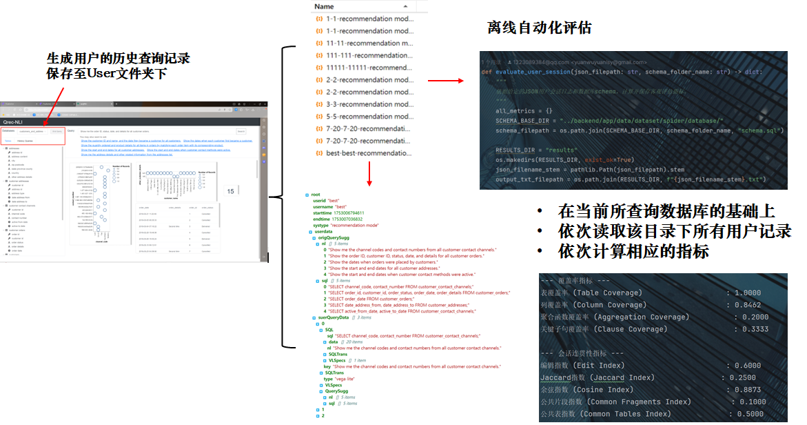

# QRec-NLI 项目评估指标 (Evaluation Metrics)

本文档详细介绍了用于评估 **QRec-NLI** 查询推荐系统性能的综合指标体系。这些指标旨在从多个维度量化推荐查询的质量，主要分为三大类：**覆盖率与多样性指标**、**会话连贯性指标** 和 **离线评估框架**。

## 目录

- [1. 覆盖率与多样性指标](#1-覆盖率与多样性指标)
  - [1.1 模式探索广度](#11-模式探索广度)
    - [表覆盖率 (Table Coverage)](#表覆盖率-table-coverage)
    - [列覆盖率 (Column Coverage)](#列覆盖率-column-coverage)
  - [1.2 操作多样性](#12-操作多样性)
    - [聚合函数覆盖率](#聚合函数覆盖率)
    - [关键子句覆盖率](#关键子句覆盖率)
- [2. 会话连贯性指标](#2-会话连贯性指标)
  - [2.1 编辑指数 (Edit Index)](#21-编辑指数-edit-index)
  - [2.2 Jaccard指数 (Jaccard Index)](#22-jaccard指数-jaccard-index)
  - [2.3 余弦指数 (Cosine Index)](#23-余弦指数-cosine-index)
  - [2.4 公共片段指数 (CF Index)](#24-公共片段指数-cf-index)
  - [2.5 公共表指数 (CT Index)](#25-公共表指数-ct-index)
- [3. 离线评估框架](#3-离线评估框架)
  - [3.1 自动化评估流程](#31-自动化评估流程)

---

## 1. 覆盖率与多样性指标

### 1.1 模式探索广度

#### 表覆盖率 (Table Coverage)
**核心思想**：衡量所有推荐查询累计覆盖了数据库中多少比例的表。

**量化公式**：

**公式解读**：该比率直观地反映了推荐系统引导用户探索数据表的广度。一个接近 1 的值意味着系统有能力将用户的注意力引向数据库的各个数据表。

#### 列覆盖率 (Column Coverage)
**核心思想**：衡量所有推荐查询累计覆盖了数据库中多少比例的列。

**量化公式**：

**公式解读**：与表覆盖率类似，但粒度更细。它衡量了系统对具体数据属性的探索广度，是评估系统能否揭示数据库中所有可用信息点的关键指标。

### 1.2 操作多样性

#### 聚合函数覆盖率

**核心思想**：衡量推荐系统展示了多少种不同的数据聚合分析方法。

**量化公式**：

**公式解读**：该比率衡量了系统推荐的分析操作类型的丰富程度。一个高分意味着系统能够建议用户进行计数、求和、求平均等多种类型的分析。

#### 关键子句覆盖率

**核心思想**：衡量推荐系统建议了多少种结构化的查询分析模式（如分组、排序、连接）。

**量化公式**：

**公式解读**：该指标衡量了推荐查询在结构上的多样性。一个高分意味着系统能引导用户进行更复杂的数据组织和关联分析，例如通过 `GROUP BY` 或 `JOIN` 等子句。

---

## 2. 会话连贯性指标

### 2.1 编辑指数 (Edit Index)

**核心思想**：基于相对编辑距离（RED），量化从一个查询“微调”到下一个查询所需的操作量。操作越少，连贯性越高。

**量化公式**：

$$
\text{RED}(q_{k-1}, q_k) = \text{Added}(q_{k-1}, q_k) + \text{Removed}(q_{k-1}, q_k)
$$

$$
\text{EditIndex}(q_{k-1}, q_k) = \max\{0, 1 - \text{RED}(q_{k-1}, q_k) / 10\}
$$

**公式解读**：将编辑距离转化为 0 到 1 的相似度分数。RED 为 0（完全相同）时，指数为 1。分母 10 是一个归一化因子，意味着超过 10 次编辑操作就被认为完全不同。

### 2.2 Jaccard 指数 (Jaccard Index)

**核心思想**：使用经典的 Jaccard 相似度，衡量两个查询共享的片段占总片段的比例。

**量化公式**：

$$
\text{JaccardIndex}(q_{k-1}, q_k) = \frac{|\text{Frags}(q_{k-1}) \cap \text{Frags}(q_k)|}{|\text{Frags}(q_{k-1}) \cup \text{Frags}(q_k)|}
$$

**公式解读**：这是衡量集合重叠度的标准方法。值越高，说明两个查询的关注点（无论是数据源、属性还是操作）重合度越高，分析的连贯性也越强。

### 2.3 余弦指数 (Cosine Index)

**核心思想**：将查询抽象为其结构复杂度的向量，通过向量间的夹角来衡量相似性。它不仅关心片段是否存在，还关心其数量。

**量化公式**：

将查询 $q_k$ 向量化为 $\mathbf{v}_k = \langle |\text{Projs}(q_k)|, \dots, |\text{Tables}(q_k)| \rangle$。

$$
\text{CosineIndex}(q_{k-1}, q_k) = \frac{\mathbf{v}_{k-1} \cdot \mathbf{v}_k}{\|\mathbf{v}_{k-1}\| \|\mathbf{v}_k\|}
$$

**公式解读**：如果两个查询的结构复杂度相似，即使具体片段不同，它们的向量方向也可能接近，余弦指数会较高。

### 2.4 公共片段指数 (CF Index)

**核心思想**：直接量化两个查询共享的片段总数，作为相似度的衡量。

**量化公式**：

$$
\text{NCF}(q_{k-1}, q_k) = \sum_{F \in \{\text{Projs}, \ldots\}} |F(q_{k-1}) \cap F(q_k)|
$$

$$
\text{CFIndex}(q_{k-1}, q_k) = \min\{1, \text{NCF}(q_{k-1}, q_k) / 10\}
$$

**公式解读**：这是一个简单直接的重叠度量。NCF 越高，说明用户从上一步继承的上下文越多。分母 10 是归一化上限。

### 2.5 公共表指数 (CT Index)

**核心思想**：强调“表”作为分析上下文核心的重要性。认为在一次连贯的分析中，用户操作的表通常是稳定的。

**量化公式**：

$$
\text{CTIndex}(q_{k-1}, q_k) = \frac{|\text{Tables}(q_{k-1}) \cap \text{Tables}(q_k)|}{\max_{q' \in C} |\text{Tables}(q')|}
$$

**公式解读**：这是一个动态归一化的指标。分母是整个会话中单个查询涉及的最大表数量，使得公共表的价值在不同复杂度的分析任务中可以被公平比较。

---

## 3. 离线评估框架

### 3.1 自动化评估流程

- **输入**：用户交互日志 (JSON) 和数据库模式 (Schema)。
- **核心**：自动化评估脚本 (`evaluator.py`)。
- **输出**：包含覆盖率、多样性和连贯性等指标的量化评估报告。
